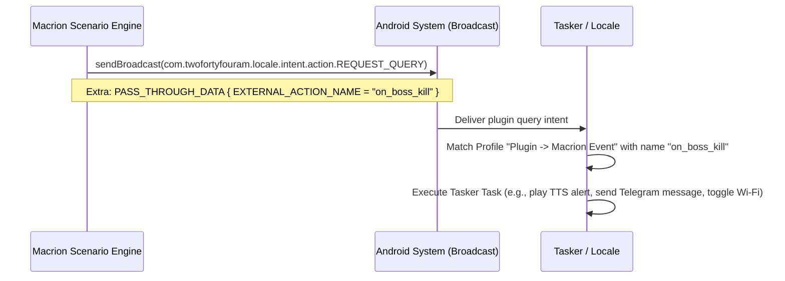

# External Integration: Intents, Notifications & Tasker

Macrion is designed to integrate seamlessly into broader Android automation ecosystems. Through **External Actions**, a running scenario can communicate with external applications, deliver real-time progress notifications to the user's status bar, launch activities with custom payloads, or fire event triggers into automation tools like **Tasker** and **Locale**.

---

## Android Intent Action (`Intent`)

The **Intent** action allows Macrion to construct and dispatch custom Android Intents. This can be used to launch external applications, open specific deep links, control media players, or trigger external automation pipelines.

```
Intent Action Configuration
 ├── Mode: Broadcast Intent OR Start Activity
 ├── Action String: e.g. "android.intent.action.VIEW", "com.example.CUSTOM_ACTION"
 ├── Component Name: Optional explicit package & class (e.g., "com.spotify.music/.MainActivity")
 ├── Flags: Bitmask integer (e.g., Intent.FLAG_ACTIVITY_NEW_TASK)
 └── Typed Extras: Key-value bundle (String, Int, Boolean, Float, Double, etc.)
```

### Broadcast vs. Activity Execution

Macrion routes intents through two distinct Android subsystems based on the `isBroadcast` flag:

```kotlin
// ActionExecutor.kt - Intent dispatching
if (intent.isBroadcast) {
    withContext(Dispatchers.Main) {
        androidExecutor.sendBroadcast(androidIntent)
    }
    delay(INTENT_BROADCAST_DELAY) // 100 ms settling delay
} else {
    withContext(Dispatchers.Main) {
        androidExecutor.startActivity(androidIntent)
    }
    delay(INTENT_START_ACTIVITY_DELAY) // 1000 ms window creation delay
}
```

#### 1. Broadcast Intents (`isBroadcast = true`)
- Dispatched via `AccessibilityService.sendBroadcast()`.
- Non-visual background signals captured by broadcast receivers (e.g., Tasker intent profiles, custom apps, smart home bridges).
- **Throttling**: Followed by a mandatory `100 ms` delay (`INTENT_BROADCAST_DELAY`) to allow receiver processing without message queue contention.

#### 2. Start Activity (`isBroadcast = false`)
- Dispatched via `AccessibilityService.startActivity()`.
- Launches a visual UI window or brings an application to the foreground.
- **Throttling**: Followed by a `1000 ms` delay (`INTENT_START_ACTIVITY_DELAY`) to allow the new window to render and obtain focus before subsequent actions or vision conditions execute.

### Typed Extras Serialization

Macrion supports adding strongly-typed extras to the intent payload. The engine supports 8 primitive data types via [`putDomainExtra`](https://github.com/vibhor1102/macrion/blob/main/core/smart/domain/src/main/java/io/github/vibhor1102/macrion/core/domain/model/action/intent/IntentExtra.kt#L63):

| Extra Type | Kotlin Primitive | Serialization Method | Example Value |
| :--- | :--- | :--- | :--- |
| **`String`** | `String` | `putExtra(key, value)` | `"com.example.run_mode"` |
| **`Int`** | `Int` | `putExtra(key, value)` | `42` |
| **`Boolean`** | `Boolean` | `putExtra(key, value)` | `true` |
| **`Float`** | `Float` | `putExtra(key, value)` | `12.5f` |
| **`Double`** | `Double` | `putExtra(key, value)` | `99.99` |
| **`Long` / `Short`** | `Short` | `putExtra(key, value)` | `16` |
| **`Byte`** | `Byte` | `putExtra(key, value)` | `0x1F` |
| **`Char`** | `Char` | `putExtra(key, value)` | `'A'` |

---

## Status Bar Notifications (`Notification`)

The **Notification** action posts updates to the Android notification drawer during automation runs. It provides live status feedback—such as notifying when a milestone is reached or when a rare game item is detected—without interrupting the foreground application.

```
Notification Action Parameters
 ├── Title: Action name or "Macrion"
 ├── Message: Text body with dynamic {counter} variables
 └── Importance Channel: High, Default, or Low
```

### Importance Channels

Notifications are categorized into three dedicated Android notification channels managed by [`NotificationRequestExecutor`](https://github.com/vibhor1102/macrion/blob/main/core/common/actions/src/main/java/io/github/vibhor1102/macrion/core/common/actions/notification/NotificationRequestExecutor.kt):

| Importance Level | Channel Behavior | Recommended Use Case |
| :--- | :--- | :--- |
| **High** (`IMPORTANCE_HIGH`) | Pops up as a **heads-up banner**, vibrates, and plays notification audio. | Urgent alerts requiring user intervention (e.g., "Captcha Detected!", "Low Energy Warning"). |
| **Default** (`IMPORTANCE_DEFAULT`) | Displays in the status bar and drawer with standard chime, without popping over the screen. | Routine milestone completions (e.g., "Boss Defeated", "Batch Completed"). |
| **Low** (`IMPORTANCE_LOW`) | Silent; appears in the notification drawer only. | Background telemetry and non-urgent status tracking. |

### Dynamic Counter Interpolation

Similar to the `SetText` action, notification messages support dynamic curly-brace placeholder interpolation (`{counterName}`):

```
Configured Message: "Completed run #{runCount}. Total gold: {goldEarned}"
Evaluated Output:  "Completed run #15.0. Total gold: 4500.0"
```

### Grouping & Auto-Cleanup

- **Event Grouping**: All notifications triggered by the same event are grouped together under the event's name (`groupName = event.name`), keeping the notification shade uncluttered.
- **Automatic Lifecycle Cleanup**: When a scenario stops or resets, `NotificationRequestExecutor.clear()` automatically cancels and removes all user action notifications posted during that run.

---

## Tasker & Locale Plugin (`ExternalAction`)

The **ExternalAction** action dispatches standard Tasker/Locale plugin IPC queries, enabling two-way communication between Macrion scenarios and external automation managers.

```
ExternalAction
 └── Action Name: Unique String identifier (e.g., "on_loot_found", "restart_device")
```

### How the Plugin Bridge Works



1. **Macrion Dispatch**: When `ExternalAction` fires, it broadcasts `com.twofortyfouram.locale.intent.action.REQUEST_QUERY` via [`ExternalActionEventContract`](https://github.com/vibhor1102/macrion/blob/main/core/common/actions/src/main/java/io/github/vibhor1102/macrion/core/common/actions/external/ExternalActionEventContract.kt).
2. **Pass-Through Payload**: The action name is bundled under `net.dinglisch.android.tasker.extras.PASS_THROUGH_DATA` with the key `io.github.vibhor1102.macrion.extra.EXTERNAL_ACTION_NAME`.
3. **Tasker Interception**: A Tasker Event profile configured with Macrion's plugin condition matches the action name and immediately executes whatever actions the user configured in Tasker (e.g., sending an SMS, dimming the screen, or saving a log to disk).

### Practical Integration Ideas

- **Remote Notifications**: Trigger an `ExternalAction` called `"alert_completed"`, and configure Tasker to send a push notification to your smartwatch or a message to a Telegram bot.
- **Device Management**: Have Tasker turn off Wi-Fi or lower display brightness when Macrion signals that an overnight farming session is complete.
- **Audio Prompts**: Use Tasker's Text-to-Speech (TTS) engine to speak a voice confirmation whenever Macrion completes an important milestone.
