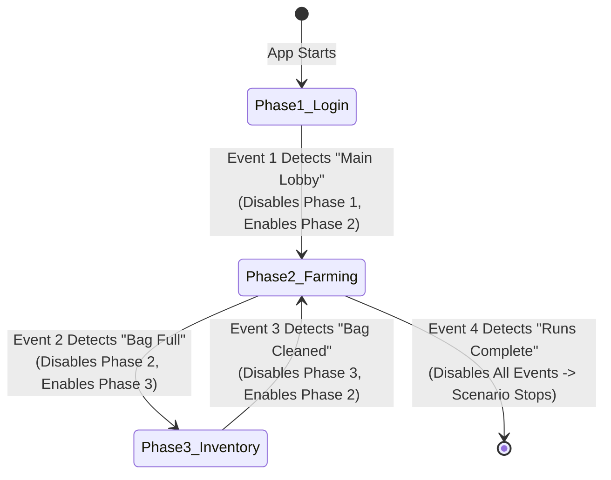

# State & Flow Actions: Counters, Toggles & Pauses

While touch and text actions interact with on-screen user interfaces, **State & Flow Actions** manage internal scenario logic. They modify runtime variables, reconfigure active event listeners on the fly, and insert precise delays between sequential operations—turning simple macro taps into complex, adaptable state machines.

---

## Change Counter (`ChangeCounter`)

The **ChangeCounter** action updates the numeric value of a named runtime variable tracked in the scenario's in-memory [`ProcessingState`](https://github.com/vibhor1102/Macrion/blob/main/core/smart/processing/src/main/java/io/github/vibhor1102/macrion/core/processing/data/processor/state/ProcessingState.kt).

```
ChangeCounter Action
 ├── Counter Name: String identifier (e.g., "dungeonRuns", "loopLimit")
 ├── Operation: ADD (+), MINUS (-), or SET (=)
 └── Operand: Static Number (e.g., 1.0) OR Dynamic Counter Value (e.g., "batchSize")
```

### Operation Types

```kotlin
// ActionExecutor.kt - Counter calculation
val oldValue = processingState.getCounterValue(changeCounter.counterName) ?: return
val operandValue = when (val operationValue = changeCounter.operationValue) {
    is CounterOperationValue.Counter -> processingState.getCounterValue(operationValue.value) ?: 0.0
    is CounterOperationValue.Number -> operationValue.value
}

processingState.setCounterValue(
    counterName = changeCounter.counterName,
    value = when (changeCounter.operation) {
        ChangeCounter.OperationType.ADD -> oldValue + operandValue
        ChangeCounter.OperationType.MINUS -> oldValue - operandValue
        ChangeCounter.OperationType.SET -> operandValue
    }
)
```

| Operation | Mathematical Formula | Common Use Case |
| :--- | :--- | :--- |
| **`ADD`** | $\text{Counter}_{\text{new}} = \text{Counter}_{\text{old}} + \text{Operand}$ | Incrementing run counts, accumulating gold/points, or tracking retry attempts. |
| **`MINUS`** | $\text{Counter}_{\text{new}} = \text{Counter}_{\text{old}} - \text{Operand}$ | Decrementing remaining energy/stamina or countdown timers. |
| **`SET`** | $\text{Counter}_{\text{new}} = \text{Operand}$ | Initializing loop boundaries, resetting retry counters to zero on success. |

### Static Numbers vs. Dynamic Counter Operands

Operands in `ChangeCounter` can be defined in two ways:
1. **Static Number (`Number`)**: A fixed numeric constant (e.g., `+1.0`, `-5.0`, or `=0.0`).
2. **Dynamic Counter Reference (`Counter`)**: The live value of another counter variable. For example:
   - Setting `remainingStamina` by copying `currentMaxStamina`.
   - Incrementing `totalExpEarned` by the value of `battleRewardExp`.

> [!NOTE]
> All counter calculations use IEEE 754 64-bit double-precision floating-point arithmetic (`Double`), supporting decimal values (e.g., `0.5`, `1.25`) as well as whole integers.

---

## Toggle Event (`ToggleEvent`)

The **ToggleEvent** action dynamically enables, disables, or inverts the active listening state of events while a scenario is running. This action enables the construction of multi-phase state machines.

```
ToggleEvent Action
 ├── Mode: Target Specific Events OR Broadcast Toggle All
 └── Toggle Type: ENABLE, DISABLE, or TOGGLE
```

### Targeted vs. Broadcast Toggling

#### 1. Targeted Event Toggles (`eventToggles`)
Applies a specific toggle manipulation to an explicit list of target events:
- **`ENABLE`**: Activates the target event. If the event is already enabled, it remains enabled.
- **`DISABLE`**: Deactivates the target event. The vision engine stops evaluating its conditions, and triggers associated with it stop listening.
- **`TOGGLE`**: Inverts the state. If enabled, it becomes disabled; if disabled, it becomes enabled.

#### 2. Broadcast Toggle All (`toggleAll = true`)
Applies a global state change across all events defined in the scenario:
- `toggleAllType = DISABLE`: Instantly disables every event. Since no events remain active, the scenario processor automatically triggers scenario termination.
- `toggleAllType = ENABLE`: Re-arms every event in the scenario simultaneously.

### Implementing Finite State Machines (FSM)

By chaining `ToggleEvent` actions, you can build phased workflows that eliminate false-positive detection:



1. **Phase Isolation**: Only events belonging to the current operational phase are enabled. Events looking for victory screens or inventory buttons remain completely disabled during combat, saving CPU cycles and preventing misfires.
2. **Automatic Shutdown**: When your scenario completes all tasks, a final event can dispatch `ToggleEvent(toggleAll = true, toggleAllType = DISABLE)`. The scenario engine cleanly terminates itself.

---

## Pause (`Pause`)

The **Pause** action suspends action execution for a configured duration in milliseconds without blocking the background processing thread.

```kotlin
// ActionExecutor.kt - Coroutine delay pause
private suspend fun executePause(pause: Pause) {
    delay(pause.pauseDuration!!.getPauseDurationMs(random))
}
```

### Non-Blocking Coroutine Delays

Unlike Java's `Thread.sleep()` which blocks the underlying execution thread, Macrion uses Kotlin's `kotlinx.coroutines.delay()`:
- **Responsive UI**: The floating overlay and stop controls remain 100% responsive during a pause.
- **Immediate Cancellation**: If you press the Volume Down emergency kill-switch or tap Stop on the floating menu, the coroutine is cancelled immediately without waiting for the pause delay to finish.

### Action Pause vs. Event Cooldown

It is important to distinguish an in-sequence **Action Pause** from an **Event Cooldown**:

| Feature | Action Pause (`Pause`) | Event Cooldown (`cooldownMs`) |
| :--- | :--- | :--- |
| **Where Configured** | Inside the event's action list. | On the parent Event settings card. |
| **Scope** | Pauses execution *between* consecutive actions in that specific event. | Locks the parent event from triggering again *after* all actions complete. |
| **Other Events** | Blocks subsequent actions in the same event; does not evaluate other events until the sequence finishes. | Other active events in the scenario continue evaluating and executing normally. |
| **Typical Use** | Waiting 500 ms for an opening modal animation to finish before clicking a confirmation button inside it. | Preventing a button tap event from firing twice while a network request is loading. |

### Pause Randomization

When **Randomization** is enabled in settings, pause durations are adjusted by a random offset $\Delta t \in [-5, +5]\text{ ms}$. A 500 ms pause will vary between 495 ms and 505 ms, preventing exact temporal predictability.
