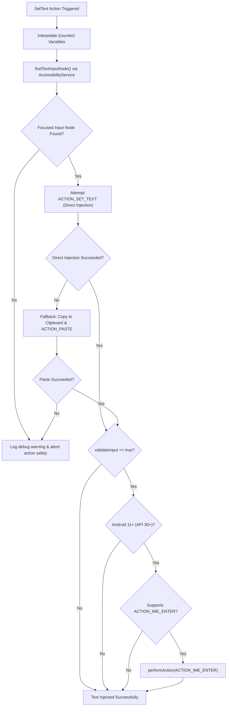

# Text Injection & Dynamic Counter Substitution

The **SetText** action allows Macrion to input arbitrary strings, numbers, and dynamic runtime variables into active text fields across any Android application. Rather than simulating individual keystrokes on an on-screen keyboard, Macrion interacts directly with the Android Accessibility node hierarchy, providing instantaneous, reliable text population.

---

## Text Injection Architecture

Text injection is managed by [`TextExecutor`](https://github.com/vibhor1102/macrion/blob/main/core/common/actions/src/main/java/io/github/vibhor1102/macrion/core/common/actions/text/TextExecutor.kt) and operates through a robust multi-stage pipeline:



---

## The Node Discovery Algorithm

For text injection to succeed, the target view (such as an `EditText`, web input box, or search bar) must have active input focus.

`TextExecutor` locates the target node using a depth-bounded tree search:

```kotlin
// TextExecutor.kt - Depth-limited node search
private fun AccessibilityNodeInfo.findTextInputNode(): AccessibilityNodeInfo? {
    val stack = ArrayDeque<Pair<AccessibilityNodeInfo, Int>>()
    stack.add(this to 0)

    while (stack.isNotEmpty()) {
        val (node, depth) = stack.removeLast()

        // Check if this node holds input focus
        if (node.isFocused) return node
        if (depth >= FOCUS_FINDER_MAX_DEPTH) continue // Depth limit: 10

        // Traverse children
        for (i in node.childCount - 1 downTo 0) {
            node.getChild(i)?.let { child ->
                stack.add(child to (depth + 1))
            }
        }
    }
    return null
}
```

1. **Initial Anchor**: Obtains the root focused node via `AccessibilityService.findFocus(AccessibilityNodeInfo.FOCUS_INPUT)`.
2. **Depth Traversal**: If the container itself is a composite view (e.g., a `TextInputLayout` containing an internal `TextInputEditText`), Macrion traverses child nodes up to a maximum depth of `10` to locate the exact editable node.

> [!TIP]
> Always pair a **Click** action immediately before a **SetText** action to guarantee that the target input field receives keyboard focus before text injection begins.

---

## Dual-Stage Injection: Direct Set vs. Clipboard Paste

Different Android applications implement text input differently. Standard native views accept direct accessibility commands, but hybrid frameworks, custom WebView components, and secure inputs often reject them.

Macrion handles this through an automatic two-tier injection mechanism:

### Tier 1: Direct Accessibility Injection (`ACTION_SET_TEXT`)
Macrion packages the target string into an accessibility bundle argument:
```kotlin
private fun AccessibilityNodeInfo.writeText(textToWrite: String): Boolean =
    performAction(
        AccessibilityNodeInfo.ACTION_SET_TEXT,
        Bundle().apply {
            putCharSequence(AccessibilityNodeInfo.ACTION_ARGUMENT_SET_TEXT_CHARSEQUENCE, textToWrite)
        }
    )
```
- **Advantages**: Instantaneous, leaves system clipboard untouched, does not require clipboard read/write permissions.
- **Limitation**: Custom UI frameworks (Flutter, React Native, certain WebViews) may return `false` if they do not bind `ACTION_SET_TEXT`.

### Tier 2: Automatic Clipboard Fallback (`ACTION_PASTE`)
If `writeText` returns `false`, Macrion automatically falls back to system clipboard pasting:
```kotlin
private fun AccessibilityNodeInfo.pasteText(service: AccessibilityService, text: String): Boolean {
    val clipboard = service.getSystemService(Context.CLIPBOARD_SERVICE) as? ClipboardManager
        ?: return false

    clipboard.setPrimaryClip(ClipData.newPlainText("text", text))
    return performAction(AccessibilityNodeInfo.ACTION_PASTE)
}
```
- The text is assigned to the system clipboard via `ClipboardManager.setPrimaryClip()`.
- Macrion immediately dispatches `AccessibilityNodeInfo.ACTION_PASTE` into the focused field.
- This ensures maximum compatibility across stubborn third-party applications.

---

## Soft Keyboard Enter Simulation (`validateInput`)

When typing manually, a user frequently presses the "Enter", "Search", or "Done" button on their software keyboard to submit a search or advance a form.

When **Validate Input** (`validateInput = true`) is enabled on a SetText action:
- On **Android 11+ (API 30+)**, Macrion inspects the focused view's supported action list for `AccessibilityNodeInfo.AccessibilityAction.ACTION_IME_ENTER`.
- If supported, Macrion dispatches `performAction(ACTION_IME_ENTER.id)`, simulating an IME enter keypress without needing to display or tap an on-screen keyboard.

```kotlin
private fun AccessibilityNodeInfo.validateInput(): Boolean {
    if (Build.VERSION.SDK_INT < Build.VERSION_CODES.R) return false

    val actionImeEnter = AccessibilityNodeInfo.AccessibilityAction.ACTION_IME_ENTER
    if (!actionList.contains(actionImeEnter)) return false

    return performAction(actionImeEnter.id)
}
```

---

## Dynamic Variable Interpolation

The SetText action is not limited to static strings. You can embed runtime scenario variables using curly-brace placeholder syntax:

$$\{ \text{counterName} \}$$

### Variable Resolution Engine

Before dispatching text to the accessibility service, [`TextCounters`](https://github.com/vibhor1102/macrion/blob/main/core/common/actions/src/main/java/io/github/vibhor1102/macrion/core/common/actions/text/TextCounters.kt) scans the input string using the regular expression `\{([^}]+)\}`.

For each matching token:
1. Macrion queries the active scenario's `ProcessingState` for the current numeric value of `counterName`.
2. The placeholder token is replaced with the live string representation of that counter.
3. Unrecognized or uninitialized tokens are left as-is.

```kotlin
// TextCounters.kt
fun String.replaceCounterReferences(counterToValueMap: Map<String, Double>): String {
    var result = this
    counterToValueMap.entries.forEach { (counterName, counterValue) ->
        result = result.replace(
            oldValue = "{$counterName}",
            newValue = counterValue.toString()
        )
    }
    return result
}
```

### Examples of Dynamic Text

| Configured Template | Active Counters | Evaluated Output |
| :--- | :--- | :--- |
| `Item_{runCount}` | `runCount = 42.0` | `Item_42.0` |
| `Search batch {batchId} at speed {speed}` | `batchId = 3.0`, `speed = 1.5` | `Search batch 3.0 at speed 1.5` |
| `Quantity: {quantity}` | `quantity = 100.0` | `Quantity: 100.0` |

---

## Summary of Action Parameters

| Parameter | Type | Required | Description |
| :--- | :--- | :--- | :--- |
| **`text`** | String | Yes | The text string to inject. Can include static text and dynamic `{counterName}` placeholder tokens. |
| **`validateInput`** | Boolean | Yes | If `true`, dispatches `ACTION_IME_ENTER` immediately after typing to submit or confirm the input (Android 11+). |
| **`priority`** | Integer | Yes | The execution sequence index among sibling actions within the parent event. |
