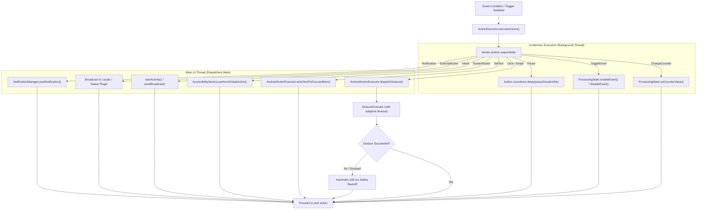

# Actions Architecture & Execution Lifecycle

In Macrion, **Actions** represent the discrete operations executed when an Event's conditions are satisfied or when an event trigger fires. While conditions and triggers observe the device environment, actions directly alter it—injecting physical touch gestures, writing text into form fields, mutating runtime variables, dispatching system shortcuts, or firing broadcast intents to external automation tools.

This document details the internal architecture of Macrion's action execution pipeline, the sequential dispatch lifecycle, anti-detection coordinate and duration randomization, and OS-level safety mechanisms.

---

## The Event-Action Relationship

Actions do not exist independently; they are strictly bound to a parent **Event**. 

```
Scenario
 └── Event 1 (Priority 10)
      ├── Conditions (Vision: Image / Color / Text / Number) OR Triggers (Timer / Counter / Broadcast)
      └── Actions [Sequential Execution List]
           ├── Action 1: Click (Tap button)
           ├── Action 2: Pause (Wait 300 ms)
           ├── Action 3: ChangeCounter (Increment run count)
           └── Action 4: ToggleEvent (Disable self, enable Phase 2)
```

Each event contains an ordered list of actions:
- **Sequential Execution**: Actions within an event are evaluated sequentially in the exact order they are listed.
- **Synchronous Completion**: Each action must fully complete (e.g., a physical tap must finish its press duration, a pause must elapse its full timer) before the dispatcher advances to the next action in the list.
- **Fail-Safe Processing**: If an action encounters a non-fatal error (such as failing to locate a focused text input), Macrion logs a diagnostic warning and continues executing the subsequent actions in the sequence.

---

## Action Execution Pipeline

When an event triggers, [`ActionExecutor`](https://github.com/vibhor1102/macrion/blob/main/core/smart/processing/src/main/java/io/github/vibhor1102/macrion/core/processing/data/processor/ActionExecutor.kt) handles the execution loop. It bridges the background coroutine processing engine with Android's main UI thread and the Android Accessibility framework.



### Thread Marshaling

Macrion separates internal state management from Android framework interactions:
1. **Background Processing**: Operations that do not touch Android views or system services (`ChangeCounter`, `ToggleEvent`, `Pause`) execute directly on the background worker coroutine thread. This avoids unnecessary thread hops and guarantees immediate variable updates.
2. **Main Thread Marshaling (`Dispatchers.Main`)**: Android's `AccessibilityService.dispatchGesture`, `performGlobalAction`, window node inspection, and activity launching must be invoked from the main thread. `ActionExecutor` marshals these calls using `withContext(Dispatchers.Main)`.

---

## Anti-Detection & Humanization Engine

Repetitive, pixel-perfect clicks and rigid timing intervals can trigger anti-bot heuristics in certain games and security-sensitive applications. Macrion includes a built-in anti-detection engine governed by [`RandomizerConfig`](https://github.com/vibhor1102/macrion/blob/main/core/common/actions/src/main/java/io/github/vibhor1102/macrion/core/common/actions/utils/RandomizerConfig.kt).

When randomization is enabled in Scenario Settings, Macrion injects controlled pseudo-random Gaussian jitter into both spatial coordinates and temporal durations.

### Spatial Randomization (Coordinates)

Whenever a touch position is dispatched (whether for static `USER_SELECTED` clicks, dynamic `ON_DETECTED_CONDITION` taps, or `Swipe` endpoints), Macrion perturbs the coordinates within a bounded offset:

$$\Delta x \in [-5, +5]\text{ px}, \quad \Delta y \in [-5, +5]\text{ px}$$

```kotlin
// GestureHelpers.kt
fun Path.moveTo(position: Point, random: Random?) {
    if (random == null) safeMoveTo(position.x, position.y)
    else safeMoveTo(
        random.nextIntInOffset(position.x, RANDOMIZATION_POSITION_MAX_OFFSET_PX),
        random.nextIntInOffset(position.y, RANDOMIZATION_POSITION_MAX_OFFSET_PX),
    )
}
```

This prevents touches from repeatedly striking the identical pixel, replicating natural human thumb and stylus variance without straying outside standard button hitboxes.

### Temporal Randomization (Durations & Pauses)

Fixed touch durations (e.g., exactly 50 ms) and fixed pause delays (e.g., exactly 1000 ms) produce artificial, easily fingerprinted execution signatures. Macrion applies a duration offset of up to $\pm 5\text{ ms}$:

$$\Delta t \in [-5, +5]\text{ ms}$$

- **Touch Press Duration**: A configured 50 ms click executes between 45 ms and 55 ms.
- **Swipe Travel Time**: A configured 300 ms swipe executes between 295 ms and 305 ms.
- **Pause Intervals**: A configured 500 ms pause sleeps between 495 ms and 505 ms.

> [!NOTE]
> Duration values are strictly normalized after randomization. Press durations cannot fall below `MINIMUM_STROKE_DURATION_MS` (1 ms) or exceed `MAXIMUM_STROKE_DURATION_MS` (65,000 ms).

---

## OS-Level Safety & Error Handling

Automating gestures across external applications can encounter system lag, ANRs, or unresponsive touch dispatchers. Macrion incorporates multiple defensive layers to maintain stability.

### 1. Adaptive Gesture Timeout

Android's `AccessibilityService.dispatchGesture` operates asynchronously with a `GestureResultCallback` (`onCompleted` or `onCancelled`). If the underlying display server or window manager stalls, a coroutine could hang indefinitely waiting for callback confirmation.

[`GestureExecutor`](https://github.com/vibhor1102/macrion/blob/main/core/common/actions/src/main/java/io/github/vibhor1102/macrion/core/common/actions/gesture/GestureExecutor.kt) wraps every gesture dispatch in a `withTimeoutOrNull` block:

$$\text{Timeout} = \text{clamp}(2 \times \text{durationMs}, 100\text{ ms}, 65\,000\text{ ms})$$

If the system fails to report completion before the timeout elapses:
1. The pending continuation is safely cancelled.
2. An error counter is incremented in diagnostic dumps.
3. The dispatcher safely proceeds rather than freezing the scenario loop.

### 2. Automatic Throttling Backoff

If the Android system reports that a gesture was cancelled or dropped, injecting further gestures immediately could overwhelm an already struggling system:

```kotlin
// AndroidActionExecutorImpl.kt
if (!gestureExecutor.dispatchGesture(service, gestureDescription)) {
    Log.w(TAG, "System did not execute the gesture properly, delaying processing to avoid spamming slow system")
    delay(500)
}
```

An automatic 500 ms backoff is enforced before the scenario engine continues.

### 3. Google Pixel Android 15 Unblock Injection

On Google Pixel devices running early Android 15 builds, a known OS bug ([Issue Tracker #384188031](https://issuetracker.google.com/issues/384188031)) causes the system `InputDispatcher` to freeze gesture dispatch if accessibility touches are submitted without intermittent hardware-like unblock taps. 

When the **Pixel Touch Unfreeze Workaround** is active in App Settings, [`UnblockGestureScheduler`](https://github.com/vibhor1102/macrion/blob/main/core/common/base/src/main/java/io/github/vibhor1102/macrion/core/base/workarounds/Android15PixelInputBlock.kt) automatically injects a harmless, multi-finger wake gesture at 10-second intervals upon loop completion.

### 4. Intent Flooding Protection

Firing external activities or broadcasts too rapidly can overwhelm Android's `ActivityManager`. Macrion enforces hard delays after executing intent actions:
- **Broadcast Delay**: `100 ms` post-broadcast delay (`INTENT_BROADCAST_DELAY`).
- **Activity Start Delay**: `1000 ms` post-activity delay (`INTENT_START_ACTIVITY_DELAY`) to allow the target application's window to create and focus.

---

## Complete Action Catalog Matrix

The table below summarizes the action types available in Macrion:

| Action Type | Execution Domain | Key Parameters | Primary Use Case |
| :--- | :--- | :--- | :--- |
| **[Click](./action-touch#clicks)** | Accessibility Touch | Position (`USER_SELECTED` vs `ON_DETECTED_CONDITION`), `clickOffset`, `pressDuration` | Tapping buttons, confirming dialogs, or dynamically tapping detected images/text. |
| **[Swipe](./action-touch#swipes)** | Accessibility Touch | `from` coordinate, `to` coordinate, `swipeDuration` | Scrolling lists, dragging sliders, flicking carousels, or performing swipe gestures. |
| **[SetText](./action-text)** | Accessibility Focus | `text` (with `{counter}` tags), `validateInput` (IME Enter) | Typing dynamic strings or numbers into focused input fields; falls back to clipboard paste. |
| **[SystemAction](./action-system)** | Accessibility Global | `Type` (`BACK`, `HOME`, `RECENT_APPS`) | Hardware-level navigation shortcuts (dismissing modals, returning home, opening app switcher). |
| **[ChangeCounter](./action-state#change-counter)** | In-Memory State | `counterName`, `operation` (`ADD`, `MINUS`, `SET`), `operationValue` | Tracking iterations, tallying rewards, or updating loop bounds. |
| **[ToggleEvent](./action-state#toggle-event)** | In-Memory State | `toggleAll` or specific `eventToggles` (`ENABLE`, `DISABLE`, `TOGGLE`) | Controlling state machines, switching automation phases, or halting execution loops. |
| **[Pause](./action-state#pause)** | Coroutine Delay | `pauseDuration` (milliseconds) | Inserting non-blocking settling delays between consecutive actions. |
| **[Intent](./action-external#android-intent)** | Android Framework | `isBroadcast`, `intentAction`, `componentName`, `flags`, `extras` | Launching external apps, triggering Tasker profiles, or sending custom system broadcasts. |
| **[Notification](./action-external#notifications)** | NotificationManager | `messageText` (with `{counter}` tags), `channelImportance` | Displaying heads-up or status bar progress alerts during automation runs. |
| **[ExternalAction](./action-external#tasker-locale-plugin)** | Locale / Tasker IPC | `externalActionName` | Sending synchronous query broadcasts to Tasker/Locale event plugins. |
