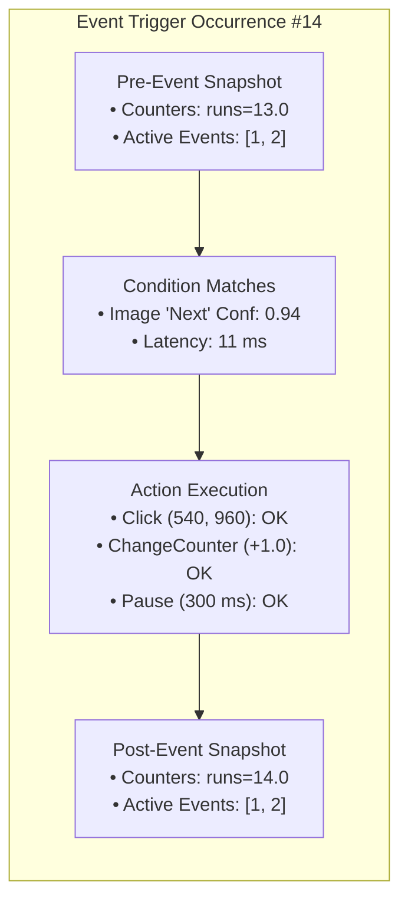

# Live Scenario Debugger & Diagnostics

When building complex automation scenarios involving multiple visual conditions, variable counters, and phase-switching state machines, unexpected behavior can occasionally occur—an image might fail to match, a gesture might land off-target, or a counter might not increment as expected.

Macrion incorporates an integrated debugging engine ([`DebugEngine`](https://github.com/vibhor1102/Macrion/blob/main/core/smart/debugging/src/main/java/io/github/vibhor1102/macrion/core/smart/debugging/engine/DebugEngine.kt)) that provides real-time visual overlays, per-condition latency profiling, and comprehensive execution event logs.

---

## Live Debugging Overlay

When **Debug Mode** is enabled in Scenario Settings, Macrion projects a transparent diagnostic layer over your screen during automation runs.

```
Live Debug Overlay Features
 ├── Condition Bounding Boxes: Color-coded detection indicators
 ├── Confidence Score Badges: Live score vs. threshold readout (e.g., "0.91 / 0.80")
 ├── Target Center Points: Visual crosshair marking the exact resolved touch point
 └── Condition Latency Tags: Real-time execution time in milliseconds
```

### Bounding Box Color Legend

Bounding boxes outline the search areas and matched templates directly on screen:

| Box Color | Status | Meaning |
| :--- | :--- | :--- |
| 🟩 **Green** | **Matched (Positive)** | The condition matched successfully and exceeded the confidence threshold. Touch offsets are anchored to this box. |
| 🟥 **Red** | **Unmatched / Failed** | The condition was evaluated during this frame but the confidence score fell below the required threshold. |
| 🟨 **Yellow** | **Negative Condition Matched** | For conditions configured with *Should Not Be Detected*, yellow indicates that the visual element was found (causing the condition to fail). |
| 🟦 **Blue** | **Active Search Area** | Outlines the restricted *In-Area* search boundary within which Macrion is inspecting frames. |

---

## Condition Profiling (`ConditionProfileRecorder`)

Optimizing scenario speed requires identifying which specific conditions consume the most CPU time.

[`ConditionProfileRecorder`](https://github.com/vibhor1102/Macrion/blob/main/core/smart/debugging/src/main/java/io/github/vibhor1102/macrion/core/smart/debugging/engine/recorder/ConditionProfileRecorder.kt) benchmarks every condition evaluation in real time, recording:
- **Execution Time**: Duration in milliseconds for each evaluation cycle.
- **Average Latency**: Rolling average over the last $N$ frames.
- **Evaluation Count**: Total number of times the condition has been checked.

```
Example Profile Breakdown:
  [Event 1: Claim Daily Reward]
    ├── Condition: "Claim Button" (Image)  -> Avg:  12.4 ms (Min: 9.1 ms, Max: 18.2 ms)
    └── Condition: "Player Level" (Number) -> Avg:  42.1 ms (Min: 36.0 ms, Max: 55.4 ms)
```

> [!TIP]
> If your overall scenario loop feels sluggish, check the condition profile. If an OCR text condition or full-screen image template is taking over 50 ms, restrict its search area or adjust resolution scaling.

---

## Event Occurrence Timeline & State Inspector

Whenever an event triggers, Macrion records a detailed snapshot ([`DebugReportEventOccurrence`](https://github.com/vibhor1102/Macrion/blob/main/core/smart/debugging/src/main/java/io/github/vibhor1102/macrion/core/smart/debugging/domain/model/report/DebugReportEventOccurrence.kt)) capturing the exact internal state of your scenario at that instant.



### What the Inspector Tracks

1. **Condition Evaluation Results**:
   - The exact confidence score calculated for every condition in the event.
   - The $(x, y)$ coordinate where the match was identified.
2. **Action Execution Results**:
   - Detailed status of each executed action (`COMPLETED`, `CANCELLED`, `TIMEOUT`).
   - For touch gestures: whether the system accessibility dispatcher confirmed receipt or reported a drop.
3. **Counter State Snapshots**:
   - Live values of all named runtime variables immediately before and immediately after the event executed.
4. **Event Toggle State Snapshots**:
   - Which events were enabled or disabled by `ToggleEvent` actions during this occurrence.

---

## Diagnostic Dumps & Bug Reporting

For persistent issues or unexpected crashes, Macrion includes a built-in diagnostic dumping subsystem implemented via the [`Dumpable`](https://github.com/vibhor1102/Macrion/blob/main/core/common/base/src/main/java/io/github/vibhor1102/macrion/core/base/Dumpsys.kt) interface.

### Generating a Diagnostic Report

1. Open Macrion ➔ **Settings** ➔ **Diagnostics & Crash Reports**.
2. Tap **Export Diagnostic Dump**.
3. Macrion compiles a sanitized plain-text diagnostic log containing:
   - Device model, Android OS version, and screen resolution.
   - Gesture execution counters (Completed, Cancelled, and Errored gesture counts from `GestureExecutor`).
   - Condition profiling averages and frame processing latencies.
   - Recent event occurrences and counter values.

### Privacy Assurance

Diagnostic dumps contain **zero personal data**:
- No screenshots or raw frame pixels are ever stored in diagnostic reports.
- Text strings are limited to scenario identifiers and user-configured event names.
- All logs can be reviewed in a standard text viewer before sharing or attaching to GitHub bug reports.
