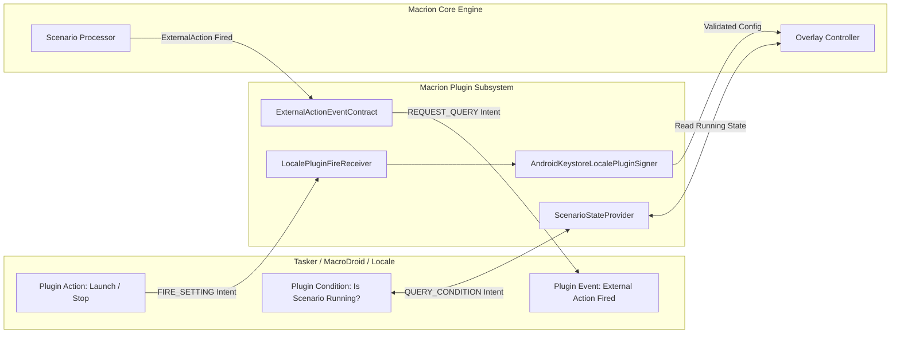

# External Automation: Tasker, Quick Settings & ADB

Macrion is architected to operate both as a standalone macro engine and as a programmable component within larger Android automation environments. Whether orchestrating routines with **Tasker**, **MacroDroid**, or **Locale**, toggling automation from the system **Quick Settings (QS) Shade**, or triggering runs over a developer **ADB shell**, Macrion provides comprehensive two-way integration.

---

## Tasker & Locale Plugin System

Macrion implements the official **twofortyfouram Locale / Tasker Plugin Architecture**. This allows automation tools to launch scenarios, inspect execution state, and receive real-time signals from Macrion events.



---

### Cryptographic Configuration Signing

To prevent malicious third-party apps on the device from forging intent broadcasts to execute unauthorized macros, Macrion protects all plugin configurations using [`AndroidKeystoreLocalePluginSigner`](https://github.com/vibhor1102/macrion/blob/main/feature/external-launch/src/main/java/io/github/vibhor1102/macrion/feature/externallaunch/localeplugin/data/AndroidKeystoreLocalePluginSigner.kt).

When a scenario is configured in Tasker:
1. Macrion serializes the configuration JSON.
2. The payload is signed using an asymmetric private key stored securely inside the hardware-backed **Android Keystore**.
3. When Tasker executes the task, [`LocalePluginFireReceiver`](https://github.com/vibhor1102/macrion/blob/main/feature/external-launch/src/main/java/io/github/vibhor1102/macrion/feature/externallaunch/localeplugin/receiver/LocalePluginFireReceiver.kt) verifies the cryptographic signature before executing any actions. Untrusted or modified payloads are rejected immediately.

---

### Plugin Operations (Actions)

When building a Task in Tasker, select **Plugin ➔ Macrion** to access the following operations:

#### 1. Launch Scenario
Starts a designated Smart or Simple scenario:
- **Instant Projection Reuse**: If Macrion is already open and holds an active `MediaProjection` token from a previous run, it swaps to the new scenario instantly (`launchSmartWithCurrentProjection`) without requiring the user to re-confirm the Android screen capture prompt.
- **Edit Conflict Protection**: If the user is currently editing a scenario in Macrion's configuration UI (`isScenarioConfigurationOpen()`), Macrion will not overwrite their unsaved work. Instead, it defers execution and posts a notification fallback (`showLaunchFallback`) so the user can start the scheduled run with one tap after saving their edits.
- **Locked Device Handling**: If the device is locked or the screen is off, direct activity launches are deferred to a high-priority notification fallback to comply with Android 10+ background activity launch restrictions.

#### 2. Run Current
Resumes execution of whichever scenario is currently loaded into the floating overlay.

#### 3. Stop
Halts active scenario processing, clears all pending gesture queues, and dismisses the floating companion toolbar.

---

### Plugin State Condition: Scenario Status

In Tasker, you can create state-based profiles using **State ➔ Plugin ➔ Macrion ➔ Scenario State**:
- Evaluates whether Macrion is currently **Running** or **Stopped**.
- Handled by [`ScenarioStateProvider`](https://github.com/vibhor1102/macrion/blob/main/feature/external-launch/src/main/java/io/github/vibhor1102/macrion/feature/externallaunch/localeplugin/scenariostate/ScenarioStateProvider.kt).
- **Practical Use Cases**:
  - *Keep Screen Awake*: Keep the display from timing out only while a Macrion scenario is actively running.
  - *Mute Media Volume*: Automatically silence game sounds while automation is active, and restore volume when finished.

---

### Plugin Event: Catching Macrion Actions

As covered in the [Action Catalog](/documentation/actions/action-external#tasker-locale-plugin), Macrion events can fire an **ExternalAction** with a custom action string.

To capture these signals in Tasker:
1. Create a Tasker Profile: **Event ➔ Plugin ➔ Macrion ➔ External Action**.
2. Enter the matching action name (e.g., `boss_defeated` or `inventory_full`).
3. Connect the event to any Tasker task (e.g., send a notification, play an alert sound, or trigger an HTTP request to Home Assistant).

---

## Quick Settings (QS) Tile

Macrion integrates with Android's system Quick Settings shade via [`QSTileService`](https://github.com/vibhor1102/macrion/blob/main/feature/external-launch/src/main/java/io/github/vibhor1102/macrion/feature/externallaunch/qstile/ui/QSTileService.kt), allowing users to launch or toggle scenarios with a single swipe-down tap.

```
Quick Settings Tile Lifecycle
 ├── Tile State: Inactive (Gray) -> No scenario running
 ├── Tap: Launches designated scenario via QSTileLauncherActivity
 ├── System Prompt: Passes MediaProjection consent if starting fresh
 ├── Tile State: Active (Accent Color) -> Scenario running
 └── Secondary Tap: Stops scenario and returns tile to Inactive
```

### Configuring the Quick Settings Tile

1. **Assign Default Scenario**: Inside Macrion's App Settings, select the scenario you want bound to the Quick Settings tile.
2. **Add Tile to Notification Shade**:
   - Swipe down twice from the top of your screen to fully expand Quick Settings.
   - Tap the **Edit (Pencil)** button.
   - Locate the **Macrion** tile under available tiles and drag it into your active panel.
3. **One-Tap Execution**: Tapping the tile will launch your configured scenario over whatever app is currently open. If the scenario is already active, tapping the tile instantly halts it.

---

## Command-Line & ADB Integration

For developers, power users, and shell scripts (such as scripts running inside **Termux** or over a USB/wireless ADB connection), Macrion supports direct broadcast triggering via the Android Activity Manager (`am`).

### Broadcast Command Reference

#### 1. Launch a Scenario by Database ID
```bash
adb shell am broadcast \
  -a io.github.vibhor1102.macrion.LAUNCH_SCENARIO \
  --el scenario_id 1
```

#### 2. Stop Any Running Scenario
```bash
adb shell am broadcast \
  -a io.github.vibhor1102.macrion.STOP_SCENARIO
```

> [!IMPORTANT]
> When testing with local debug builds, Android app IDs append `.debug`. Replace the package prefix accordingly:
> ```bash
> adb shell am broadcast -a io.github.vibhor1102.macrion.debug.STOP_SCENARIO
> ```

### Screen Capture Authorization Over ADB

When launching a **Smart Scenario** via ADB or background scripts, Android's operating system requires that a user physically confirm the `MediaProjection` consent dialog on screen at least once. 

Once granted, as long as Macrion's foreground service remains active, subsequent ADB scenario switches can reuse the active projection session without prompting again.
