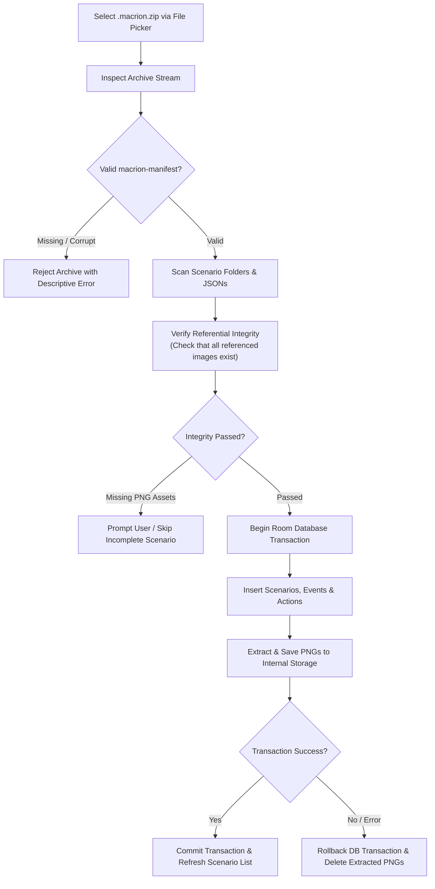

# Backup Architecture & Archive Storage

Your automation scenarios can represent hours of meticulous layout, coordinate calibration, and logic sequencing. Macrion implements an open, lossless backup architecture built on standard ZIP compression and Android's **Storage Access Framework (SAF)**, allowing you to back up, restore, and transfer your scenarios across devices with zero vendor lock-in.

---

## The Storage Philosophy

Macrion operates under a strict offline-first, local-storage model:
- **Zero Proprietary Cloud Lock-In**: Macrion does not rely on a private server or closed cloud account to synchronize macros. All scenario data remains 100% under your ownership.
- **Android Storage Access Framework (SAF)**: Backup and restore operations utilize native Android document pickers. You can save or load backup archives directly to/from internal device storage, external MicroSD cards, USB OTG drives, or connected cloud storage providers (Google Drive, Nextcloud, Synology Drive, Dropbox).
- **Human-Readable Open Formats**: Scenarios are serialized as standard formatted JSON accompanied by raw PNG graphic assets, making them easily inspectable or version-controlled in Git.

---

## Native Macrion Archive Specification (`.macrion.zip`)

Native Macrion backups are packaged as standard `.zip` archives with a specialized internal directory structure governed by the **Macrion Backup Contract**.

```text
Macrion-Backup-2026-09-07.macrion.zip
 ├── macrion-manifest.macrion.json        <-- Archive metadata & container version
 ├── 101/                                  <-- Smart Scenario folder (ID: 101)
 │    ├── 101.macrion.json                <-- Scenario structure, events & actions
 │    ├── Condition-201.macrion.png       <-- Raw cropped condition template image
 │    └── Condition-202.macrion.png       <-- Raw cropped condition template image
 ├── 102/                                  <-- Smart Scenario folder (ID: 102)
 │    └── 102.macrion.json
 └── dumb-301/                             <-- Simple (Position-Based) Scenario folder
      └── 301.macrion.json
```

### 1. The Container Manifest (`macrion-manifest.macrion.json`)
The root manifest validates the archive identity and declares container-level specifications:
- `containerVersion`: The version of the Macrion archive format.
- `macrionVersion`: The version string of the Macrion app that generated the backup.
- `schemaVersion`: The Room database schema version utilized by the scenario definitions.
- `createdAt`: ISO 8601 creation timestamp.

### 2. Scenario Definitions (`{id}.macrion.json`)
Each scenario resides in its own numbered directory. The JSON payload encapsulates the complete hierarchical tree of the scenario:
- **Scenario Metadata**: Name, description, detection frequency, downscaling factor, and orientation settings.
- **Counters**: Initial variable names and default numeric values.
- **Events**: Priority indexes, enabled-on-start flags, cooldown delays, and condition evaluation operators (`AND` / `OR`).
- **Conditions**: Color coordinates, image template matching parameters, OCR text queries, and counter comparison operators.
- **Actions**: Ordered sequence of clicks, swipes, pauses, counter updates, event toggles, notifications, and intent configurations.

### 3. Asset Bundling (`Condition-{id}.macrion.png`)
Image conditions require reference graphic templates to evaluate cross-correlations on screen. During export:
- All cropped condition templates are extracted from Macrion's internal app storage.
- Templates are stored alongside their parent scenario JSON as lossless 24-bit/32-bit PNG files.
- The scenario JSON references these assets strictly by file naming convention (`Condition-201.macrion.png`), ensuring complete portability when transferred to other devices.

---

## The Sub-Extension Invariant (`.macrion.*`)

A defining design decision of native Macrion backups is the **`.macrion` sub-extension invariant**:

$$\text{filename} = \text{base} + \text{".macrion"} + \text{extension}$$

Notice that every file inside the archive is named with `.macrion` preceding its standard extension:
- `macrion-manifest.macrion.json`
- `101.macrion.json`
- `Condition-201.macrion.png`
- `.macrion.zip`

### Why This Invariant Exists
Macrion is derived from Klick'r, which also uses `.zip` backups containing `101.json` and `Condition-201.png`. 

However, Macrion's database schema includes powerful features that Klick'r does not support (e.g., neural NCNN text OCR, counter triggers, broadcast receivers, dynamic `{counter}` interpolation, and system global navigation actions). 

If an older Klick'r installation attempts to read a native Macrion backup:
- Without the sub-extension, Klick'r's parser would attempt to ingest the newer JSON schema, encounter unknown entity types, and crash or corrupt the user's database.
- **With the sub-extension**: Klick'r's file matchers ignore `.macrion.json` and `.macrion.png` entries completely, cleanly preventing accidental data corruption.

---

## Exporting Scenarios

You can generate backup archives directly from the Macrion interface:

1. Open **Macrion** ➔ Navigate to the **Backup & Restore** tab (or three-dot top menu).
2. Tap **Export Scenarios**.
3. Choose your export scope:
   - **All Scenarios**: Compiles every Smart and Simple scenario into a consolidated master archive.
   - **Select Scenarios**: Check individual scenarios to package a specific automation routine (e.g., to share with a friend or upload to a repository).
4. Select a destination in Android's Storage Access Framework file picker.
5. Macrion bundles the JSON structures and graphic assets into a `.macrion.zip` file.

> [!TIP]
> Keep regular backup exports before performing Android OS system upgrades or switching phones.

---

## Import Pipeline & Validation Boundaries

When importing a `.macrion.zip` backup, Macrion executes a multi-stage validation pipeline to safeguard your existing scenario library:



### Referential Integrity & Orphan Prevention
- **Missing Asset Detection**: If a scenario JSON references `Condition-456.macrion.png` but the image file is missing from the archive, Macrion alerts you before importing rather than silently creating broken conditions.
- **Atomic Rollback**: Database insertion and asset copying are bound together. If an import fails midway (due to low disk space or an invalid entry), the entire transaction rolls back, and any partially extracted image files are deleted immediately—preventing orphaned files from cluttering your device storage.
- **ID De-Duplication**: Scenario, event, condition, and action database IDs are dynamically re-assigned upon import. Importing an archive never overwrites or collides with existing scenarios in your library, even if they share the same original numerical IDs.
