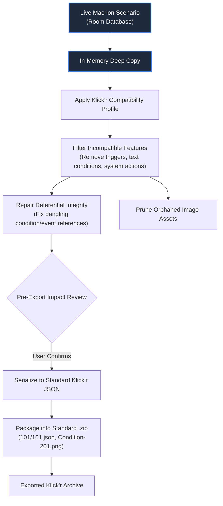

# Klick'r Migration & Dual-Format Compatibility

Macrion is an independent Android automation application developed by Vibhor, originally derived from [Klick'r](https://github.com/Nain57/Smart-AutoClicker) created by Kevin Buzeau (Nain57). While Macrion has evolved into an independent project with Material Design 3 / Material You styling, expanded trigger types, neural NCNN OCR text detection, runtime counter variables, and system integration, it maintains full bidirectional compatibility with the wider Klick'r ecosystem.

This document details how to migrate existing Klick'r scenarios into Macrion, and how Macrion's **Compatibility Projection Engine** allows you to export scenarios that can be imported back into older Klick'r installations without data corruption.

---

## Migrating from Klick'r to Macrion

If you have spent months creating and tuning scenarios in Klick'r, you do not need to recreate them from scratch. Macrion natively parses, migrates, and upgrades legacy Klick'r backup archives.

```text
Legacy Klick'r Backup (.zip)
 ├── 101/
 │    ├── 101.json                   <-- Standard legacy JSON
 │    └── Condition-201.png          <-- Standard legacy PNG asset
 └── dumb-301/
      └── 301.json
```

### Import Procedure

1. **Export from Klick'r**: Open Klick'r on your device, navigate to the backup screen, and export your scenarios to a standard `.zip` backup file.
2. **Open Macrion**: Open Macrion ➔ Navigate to **Backup & Restore** ➔ Tap **Import Scenarios**.
3. **Select the Backup**: Choose the legacy `.zip` file using Android's file picker.
4. **Automatic Schema Migration**:
   - Macrion detects that the archive uses the legacy layout (standard `.json` and `.png` entries without `.macrion` sub-extensions).
   - The migration engine reads the legacy JSON structures and maps them into Macrion's current Room database entities.
   - Reference images are extracted, sanitized, and stored inside Macrion's private app directory.
5. **Ready to Run**: The imported scenarios appear immediately in your scenario list, fully upgraded and ready to run.

---

## Exporting Klick'r-Compatible Backups

If you need to share a scenario with a colleague, friend, or community member who still uses Klick'r, you can export a **Klick'r-Compatible Archive**.

### In-Memory Compatibility Projection

To prevent data corruption, Macrion never downgrades or alters your live scenario data in your local database. Instead, it builds compatibility exports using an **in-memory projection pipeline**:



1. **In-Memory Isolation**: The scenario is cloned in device memory; your original scenario in Macrion remains 100% intact and unchanged.
2. **Feature Filtering & Adaptation**: Macrion-exclusive components that Klick'r cannot parse are either converted to equivalent legacy structures or pruned.
3. **Reference Repair**: If an action was targeted at a condition that had to be omitted, Macrion repairs the event's action list so Klick'r does not receive broken pointer IDs.
4. **Asset Pruning**: Any condition images that belonged exclusively to omitted conditions are stripped from the archive, keeping the ZIP compact.
5. **Exact Naming Layout**: The generated archive uses the exact legacy naming convention (`101/101.json` and `Condition-201.png`) with **no `.macrion.*` entries**, ensuring that Klick'r recognizes every file.

---

## Feature Compatibility Matrix

When projecting a Macrion scenario into a Klick'r-compatible format, features are handled according to the following matrix:

| Feature Category | Component | Native Macrion (`.macrion.zip`) | Klick'r-Compatible Export (`.zip`) | Compatibility Projection Outcome |
| :--- | :--- | :--- | :--- | :--- |
| **Touch Actions** | Clicks (Static & Condition) | Supported | Supported | Preserved unchanged. |
| | Swipes & Drags | Supported | Supported | Preserved unchanged. |
| | Action Pauses | Supported | Supported | Preserved unchanged. |
| **System Actions** | Back, Home, Recent Apps | Supported | ❌ Not in Klick'r | Omitted with warning. Dependent event sequence adjusted. |
| **State Actions** | ChangeCounter | Supported | ❌ Not in Klick'r | Omitted with warning. |
| | ToggleEvent | Supported | Supported | Preserved (mapped to legacy event toggle format). |
| | SetText | Supported | ❌ Not in Klick'r | Omitted with warning. |
| **Vision Conditions** | Image Template Matching | Supported | Supported | Preserved unchanged with PNG templates. |
| | Color Conditions | Supported | Supported | Preserved unchanged. |
| | Neural OCR (Text) | Supported | ❌ Not in Klick'r | Omitted with warning; dependent clicks unlinked. |
| | Numeric Conditions | Supported | ❌ Not in Klick'r | Omitted with warning. |
| **Event Triggers** | Timer Triggers | Supported | ❌ Not in Klick'r | Omitted; screen-independent triggers not in Klick'r. |
| | Counter Triggers | Supported | ❌ Not in Klick'r | Omitted. |
| | Broadcast Triggers | Supported | ❌ Not in Klick'r | Omitted. |

---

## Pre-Export Impact Assessment

To guarantee complete transparency, Macrion never exports a compatibility archive silently:

1. In the **Export Scenarios** screen, select **Klick'r-Compatible Export**.
2. If your scenario contains features that cannot be represented in Klick'r, Macrion presents a **Compatibility Impact Report**:
   ```
   ⚠️ Compatibility Adjustments for "Farming Routine":
   • 2 Neural Text Conditions will be omitted.
   • 1 System Action (Back) will be omitted.
   • 1 Counter Trigger will be omitted.
   All touch clicks, swipes, and image conditions will remain intact.
   ```
3. You can review the impact report and confirm the export, or cancel if you prefer to retain the scenario exclusively in native Macrion format.

> [!WARNING]
> Always maintain a native `.macrion.zip` export as your primary backup. The Klick'r-compatible export is a projected compatibility copy designed strictly for legacy interoperability.
